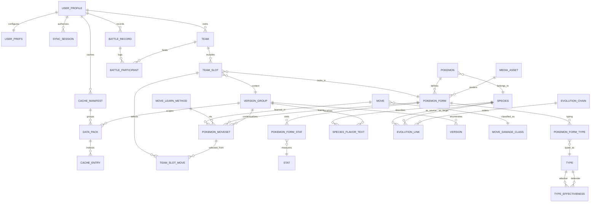

# Manny's PokeApp — ERD & Delivery Plan

## Architecture Notes
- Adopt a three-layer structure (`data` → `domain` → `presentation`) to keep networking, persistence, and UI concerns isolated. Repositories expose domain models, while view models remain test-friendly.
- Normalize authoritative PokéAPI data so forms, stats, and version group variants are reusable without duplication. User-authored records (teams, battle logs) reference canonical entities to stay DRY.
- Shared infrastructure services (cache manager, sync orchestrator, mock battle engine) live under a dedicated `infrastructure` module used by repositories and domain services.

## Entity Relationship Diagram

### Entity Highlights

**Reference Data (sourced from PokéAPI)**
- `POKEMON` / `POKEMON_FORM`: separates species-wide identity from form-specific stats, sprites, and typing. `MEDIA_ASSET` deduplicates sprite, icon, and audio blobs for offline storage.
- `POKEMON_FORM_STAT` + `STAT`: keeps stat definitions reusable across computed stat services.
- `POKEMON_FORM_TYPE`, `TYPE`, `TYPE_EFFECTIVENESS`: supports mock battle multipliers without hard-coding matchups.
- `SPECIES`, `EVOLUTION_CHAIN`, `EVOLUTION_LINK`, `SPECIES_FLAVOR_TEXT`: model evolution rules and flavor text per version group.
- `MOVE`, `MOVE_DAMAGE_CLASS`, `MOVE_LEARN_METHOD`, `POKEMON_MOVESET`: capture how moves become available across forms and version groups.
- `VERSION_GROUP`, `VERSION`: normalize generation-specific content; every cache entry references the applicable scope.

**User Authored Data**
- `USER_PROFILE`: single local profile (kept extensible for multi-user). `USER_PREFS` stores theme, accessibility, cache budget, and backup cadence.
- `TEAM`, `TEAM_SLOT`, `TEAM_SLOT_MOVE`: represent teams, individual Pokemon selections with context (form, level, version group), and move choices traced back to canonical learnset entries (`POKEMON_MOVESET`).
- `BATTLE_RECORD`, `BATTLE_PARTICIPANT`: persist mock battle outcomes with per-team scores and metadata for analytics and sync.

**Infrastructure & Support**
- `CACHE_MANIFEST`, `DATA_PACK`, `CACHE_ENTRY`: track cached datasets, region/version packs, and individual entity freshness to coordinate offline availability and pruning.
- `SYNC_SESSION`: Google Drive auth tokens & sync health. Linked to manifest so backups include cache metadata when requested.
- `MEDIA_ASSET`: local asset store (sprites, sounds) keyed by hash to avoid duplicates across forms and packs.

## DRY & Segmentation Considerations
- Canonical learnsets (`POKEMON_MOVESET`) feed both the comparison view and team builder, ensuring stat calculators, legality checks, and move selections draw from one source of truth.
- Offline cache metadata is centralized in `CACHE_ENTRY`, enabling shared eviction, validation, and sync logic regardless of whether data was fetched on-demand or via packs.
- Shared domain services (stat calculator, type matchup resolver, battle scorer) consume normalized tables, so UI layers stay thin and testable.

## Phased Milestones & Test Strategy

| Phase | Focus & Deliverables | Key Unit Tests | Key Integration Tests |
| ----- | -------------------- | -------------- | --------------------- |
| **Phase 1 — Foundation & Data Layer (2-3 weeks)** | Flutter scaffold, dependency injection, PokéAPI client abstractions, local database with entities above, cache manager skeleton, media asset loader. | Repositories (Pokemon, Move, Version), DTO ↔ entity mappers, cache manifest service logic, media asset hashing. | Drift/Isar persistence round-trips, offline-first fetch with mocked PokéAPI, cache eviction workflow. |
| **Phase 2 — Browsing & Comparison (2 weeks)** | Pokemon browser, advanced search/filter, comparison view with base/computed stats, type matchup preview, selective caching triggers. | `StatCalculator`, `ComparisonViewModel`, filter combinators, type effectiveness resolver. | Widget tests for comparison screen, integration test ensuring cached stats served offline, golden tests for comparison cards (baseline accessibility). |
| **Phase 3 — Teams & Detail (2 weeks)** | Detail pages per version group, legal learnset display, team builder with open/closed mode rules, team persistence and validation. | `TeamValidator`, `LearnsetService`, `TeamRepository`, domain rules for open vs closed mode. | Integration test covering full team creation/edit flow, DB + UI sync for form/version switches, accessibility audit automation (semantics checks). |
| **Phase 4 — Mock Battles & Cloud Sync (2 weeks)** | Lightweight battle simulation, battle logs, Google Drive backup/restore, conflict resolution (last-write-wins) with manifest. | `BattleScoringService`, `SyncOrchestrator`, backup diff builder, serialization guards. | Full battle simulation against fixture teams, sync round-trip with mocked Drive API, offline-to-online reconciliation scenario. |
| **Phase 5 — Hardening & Release (1 week)** | Performance tuning, cache budgeting UX, comprehensive logging/telemetry, localization hooks, final accessibility pass. | Load-testing utilities, telemetry formatters, accessibility preference handlers. | End-to-end smoke on representative devices, upgrade/migration path test, failover/backoff scenarios for PokéAPI outages. |

**Ongoing Quality Gates**
- Enforce `flutter analyze`, `dart test`, and `integration_test` suites in CI; add golden tests for high-value screens and contract tests for domain services.
- Maintain deterministic test fixtures by snapshotting PokéAPI responses into the cache layer; integration tests run against local fixtures to guarantee stability.
- Increment schema versions via migrations; include regression tests for data migrations to protect cached user teams and packs.
