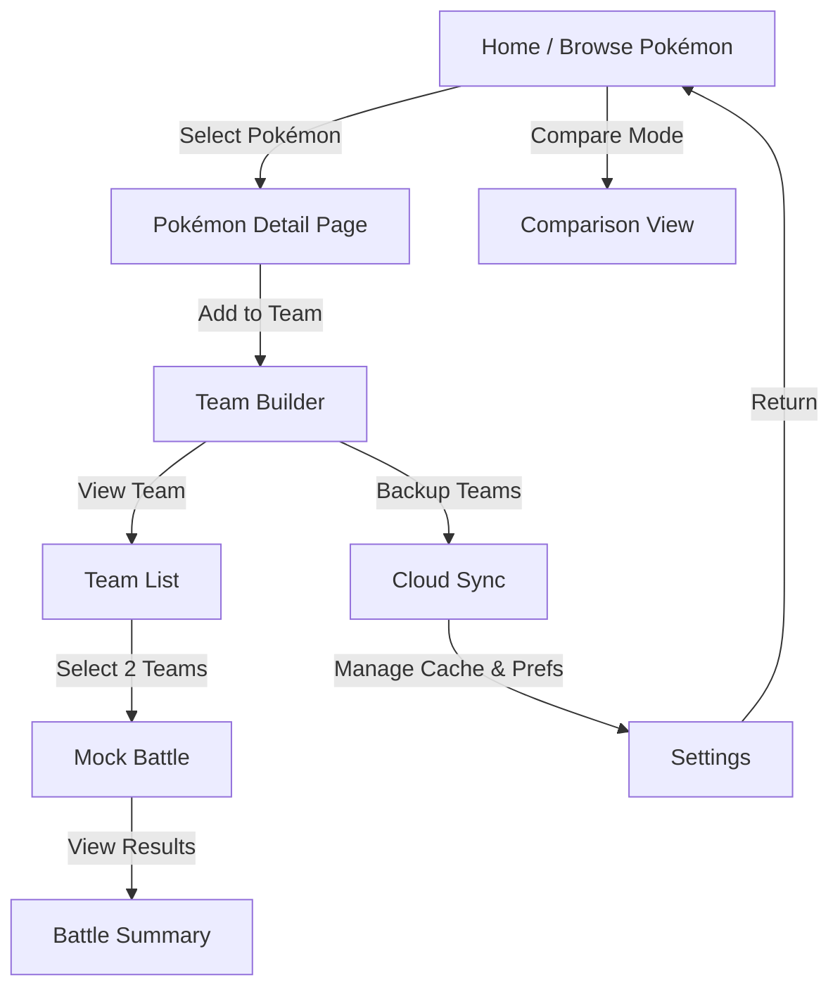
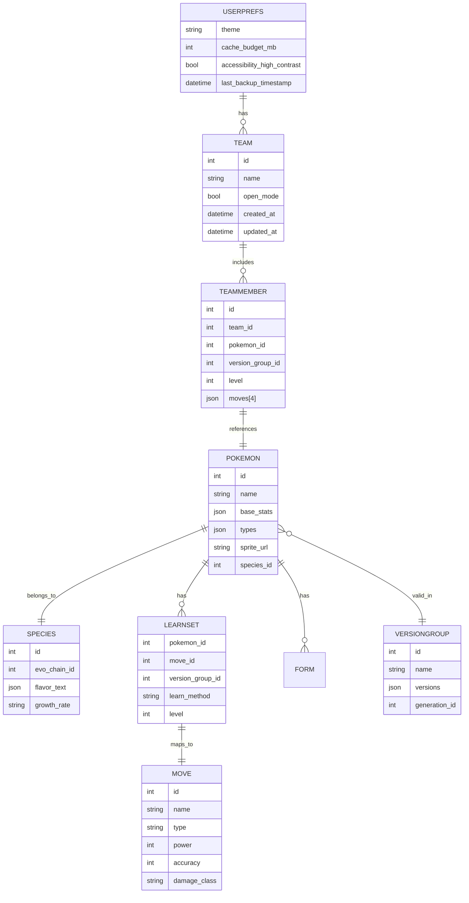
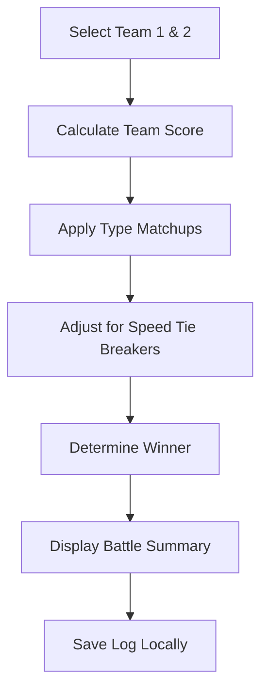

# Manny’s PokéApp — Key Diagrams

## 1. High-Level UI Flow Diagram



**Flow Notes:**

- The app starts on **Home/Browse Pokémon** with search/sort filters.
- Users move freely between **Detail**, **Compare**, and **Team** pages.
- **Cloud Sync** and **Settings** are accessible globally.
- **Offline** operation means all arrows remain valid even without internet (as long as cached).

---

## 2. Data Schema Diagram



**Schema Notes:**

- Separation between `Pokémon` and `Species` ensures version/form flexibility.
- `VersionGroup` normalizes generation/version-specific data.
- `Learnset` bridges Pokémon ↔ Move ↔ Version relationships.
- `Team` and `TeamMember` form the core of user data synced to the cloud.

---

## 3. Offline Caching Flow

```mermaid
graph LR
    A[PokéAPI Endpoint] -->|Fetch & Normalize| B[Data Normalizer]
    B -->|Store JSON Objects| C[Local DB (SQLite/Isar)]
    C -->|Serve Cached Data| D[UI Components]
    D -->|Trigger Prefetch| E[Cache Manager]
    E -->|Download Region/Version Packs| A
```

**Flow Notes:**

- The cache manager handles both on-demand and pack downloads.
- Respect PokéAPI rate limits by throttling requests.
- Indexed/normalized data enables efficient offline queries.

---

## 4. Mock Battle Logic (Lite)



**Computation Notes:**

- Team score = Σ(weighted offensive + defensive stats)
- Type matchup = multiplier based on type chart (1x, 2x, 0.5x, 0x)
- Output includes match summary and MVP Pokémon suggestion

---

**End of Diagrams**
